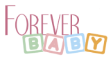

</img>

---

<div style="text-align: center;">

  
  </img>
  
  </img>
  
  </img>

</div>


<br />

## ***Sobre***

 Este projeto é uma landing page funcional de um e-commerce de produtos para bebês

 >voce pode visitar a página neste [link](https://foreverbaby.netlify.app/)


<br />

 ### ***Para rodar o projeto localmente siga os próximos passos:***


<br />

#### *Primeiro abra o terminal e escolha a pasta onde deseja salvar o projeto e digite o comando:*

 ```bash
    git clone https://github.com/thalysmcarrara/forever-baby-landing-page.git
 ```

#### *O próximo passo é entrar na pasta criada, para isso digite o comando:*

```bash
    cd forever-baby-landing-page
```

 #### *instale as dependencias:*

```bash
    npm install 
```

#### *e por fim:*

```bash
    npm start
```